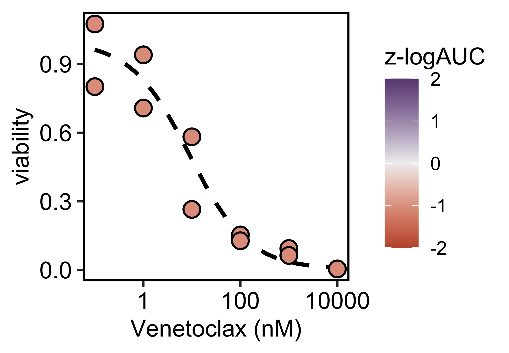
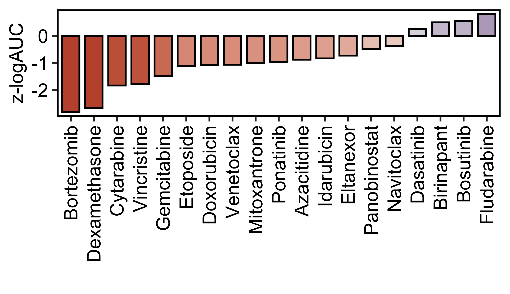

# Figure DRP

Image-based drug response profiling (DRP) of a patient-derived xenograft
(PDX) quantified from an [OME-Zarr
dataset](https://zenodo.org/records/18506825) using Fractal.

## Setup

``` r
here::i_am("Fig_DRP.qmd")
```

``` r
theme_simple <- function() {
  ggpubr::theme_pubr() +
    ggplot2::theme(
      panel.border = ggplot2::element_rect(fill = NA, linewidth = 1),
      axis.line = ggplot2::element_line(linewidth = 0),
      legend.position = "right",
    )
}
```

## Viability plot

Dose reponse curve of the BCL2 inhibitor venetoclax.

``` r
viability_measurement <- readr::read_csv(
  here::here("dataset/viability_measurement.csv")
)
viability_prediction <- readr::read_csv(
  here::here("dataset/viability_prediction.csv")
)
```

``` r
ggplot2::ggplot(mapping = ggplot2::aes(x = concentration, y = norm_response)) +
  ggplot2::geom_line(
    data = viability_prediction,
    linetype = "dashed",
    linewidth = 1
  ) +
  ggplot2::geom_point(
    data = viability_measurement,
    ggplot2::aes(fill = zlogAUC),
    size = 3.5,
    shape = 21,
    stroke = 0.75,
    color = "black"
  ) +
  ggplot2::scale_color_gradientn(
    name = "z-logAUC",
    colors = c("#C25539", "#F0F0F0", "#694a82"),
    limits = c(-2, 2),
    oob = scales::oob_squish,
    aesthetics = "fill"
  ) +
  ggplot2::scale_x_continuous(trans = "log10") +
  ggplot2::xlab("Venetoclax (nM)") +
  ggplot2::ylab("viability") +
  theme_simple()
```



## Drug distribution plot

Drug activity quantified as the logarithmic area under the dose response
curve (logAUC) for each tested drug and z-scored relative to a leukemia
cohort.

``` r
feature <- readr::read_csv(
  here::here("dataset/drug_logAUC.csv")
)
```

``` r
ggplot2::ggplot(
  ggplot2::aes(
    x = forcats::fct_reorder(drug_name, zlogAUC),
    y = zlogAUC,
    fill = zlogAUC
  ),
  data = feature
) +
  ggplot2::xlab("") +
  ggplot2::ylab("z-logAUC") +
  ggplot2::geom_bar(stat = "identity", color = "black", width = 0.75) +
  ggplot2::scale_color_gradientn(
    colors = c("#C25539", "#F0F0F0", "#694a82"),
    limits = c(-2, 2),
    oob = scales::oob_squish,
    aesthetics = "fill",
  ) +
  theme_simple() +
  ggplot2::guides(fill = "none") +
  ggpubr::rotate_x_text(angle = 90)
```


